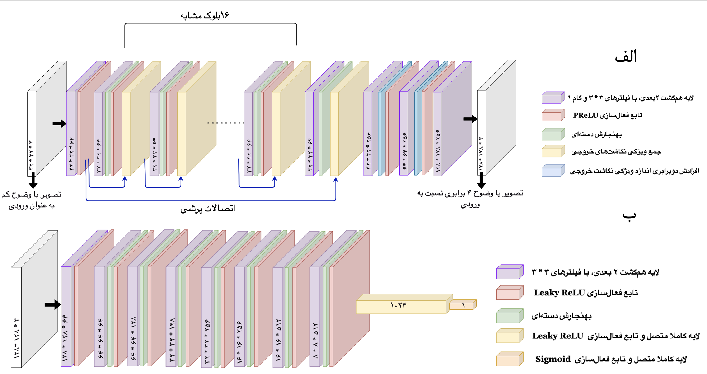
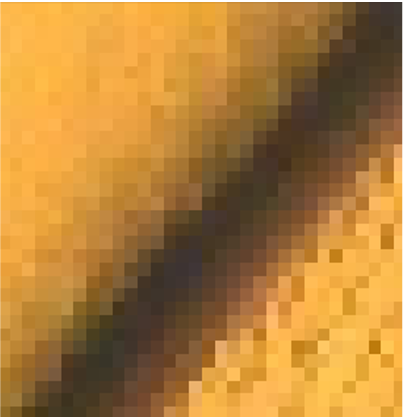
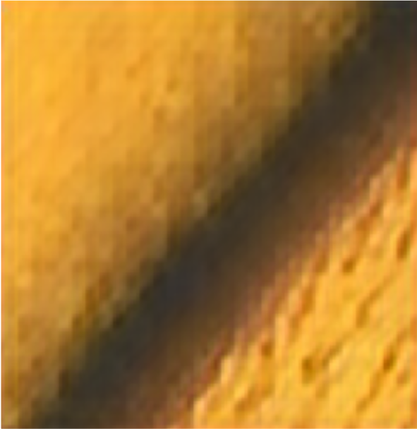
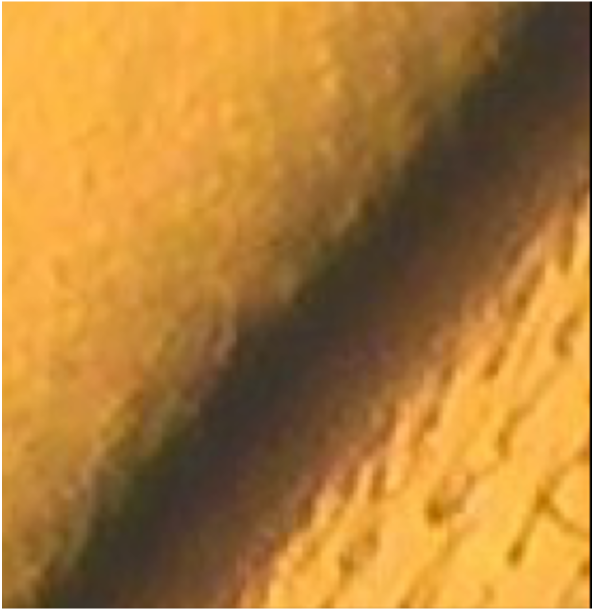

# Microscopy Image Super-Resolution using SRGAN
### TensorFlow 2.x • NVIDIA RTX 3060 • VGG19 Perceptual Loss • Custom Augmentation Pipeline

---

## 🔬 Overview

This repository implements a Super-Resolution Generative Adversarial Network (**SRGAN**) 
designed to enhance low-resolution microscopy images (32×32) to high-resolution (128×128).  
The full workflow includes:

- Raw image patch extraction  
- Rotation & flip augmentations  
- LR/HR paired dataset generation  
- GPU-accelerated SRGAN training (Generator + Discriminator)  
- Perceptual loss using VGG19 features  
- Evaluation with PSNR / SSIM / MSE  

This work was partially presented in a conference poster (included below).

---

## 🧬 Network Architecture (Farsi Diagram)

Below is the diagram of the SRGAN generator & discriminator architecture used in this project:



---

## 🧪 Example Results

A real microscopy example (32×32 → 128×128):

| Low-Resolution | SRGAN Output | Ground Truth |
|----------------|--------------|--------------|
|  |  |  |

The SRGAN successfully reconstructs edge continuity, fine texture, and structural details from heavily downsampled inputs.

---
## 📊 Quantitative Results

| Metric | Value |
|--------|-------|
| **PSNR** | 26 dB |
| **SSIM** | 0.85 |
---

## ⚡ GPU Acceleration

Training was performed on:

- **NVIDIA RTX 3060 (12 GB)**  
- TensorFlow 2.x  
- `tf.distribute.MirroredStrategy` for multi-GPU compatibility  

```python
print("Num GPUs Available:", len(tf.config.list_physical_devices("GPU")))
strategy = tf.distribute.MirroredStrategy()
